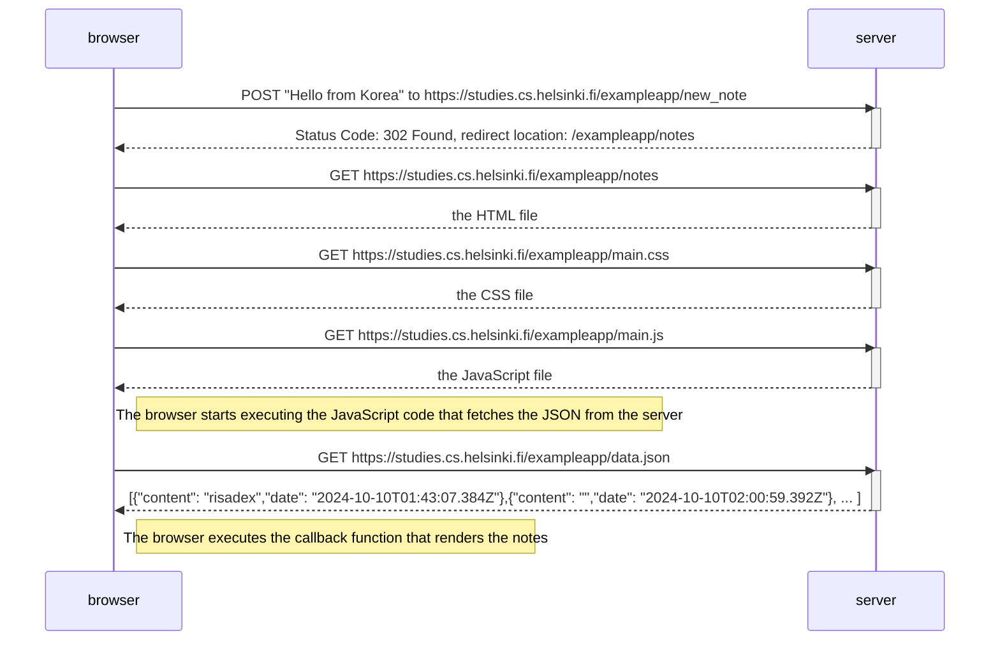

```mermaid
    sequenceDiagram
        participant browser
        participant server

        browser->>server: POST "Hello from Korea" to  https://studies.cs.helsinki.fi/exampleapp/new_note
        activate server
        server-->>browser: Status Code: 302 Found, redirect location: /exampleapp/notes
        deactivate server

        browser->>server: GET https://studies.cs.helsinki.fi/exampleapp/notes
        activate server
        server-->>browser: the HTML file
        deactivate server

        browser->>server: GET https://studies.cs.helsinki.fi/exampleapp/main.css
        activate server
        server-->>browser: the CSS file
        deactivate server

        browser->>server: GET https://studies.cs.helsinki.fi/exampleapp/main.js
        activate server
        server-->>browser: the JavaScript file
        deactivate server

        Note right of browser: The browser starts executing the JavaScript code that fetches the JSON from the server

        browser->>server: GET https://studies.cs.helsinki.fi/exampleapp/data.json
        activate server
        server-->>browser: [{"content": "risadex","date": "2024-10-10T01:43:07.384Z"},{"content": "","date": "2024-10-10T02:00:59.392Z"}, ... ]
        deactivate server

        Note right of browser: The browser executes the callback function that renders the notes
```